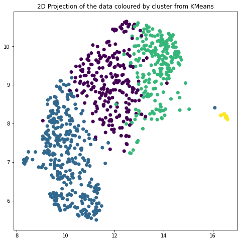
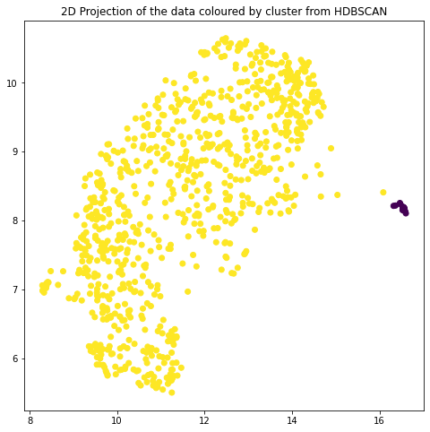

# Short-text-analyzer


This ShortTextAnalyzer was created to help analyze the open-ended survey response which usually has less than three sentences. The analysis includes topic modeling, sentiment analysis, and visualization. This topic modeling was done using pre-trained representations of language, namely BERT, combine with the clustering algorithm.

Documentation Page: https://thisisphume.github.io/short-text-analyzer/

## Install

`pip install short-text-analyzer`

Install all the required packages from the requirement.txt file.

`pip install -r requirements.txt`

## How to use

```python
from short_text_analyzer.core import *

analyzer = shortTextAnalyzer(comments_series, 4)
output_result = analyzer.analyze_getResult()
```

Here we specify that we want 4 clusters/topic from this data.

## Output: result
- `sentimentScore`: Polarity score ranges from [-1,1] where 1 means positive statement and -1 means a negative statement. 
- `Subjective`: score ranges from [0,1] where 1 refer to personal opinion, emotion or judgment and 0 means it is factual information. 
- `clusterByKMeans`: assigned cluster number for each comments using KMeans
- `clusterByHDBSCAN`: assigned cluster number for each comments using HDBSCAN

```python
output_result.sample(2)
```


<div>
<table border="1" class="dataframe">
  <thead>
    <tr style="text-align: right;">
      <th></th>
      <th>comments</th>
      <th>comment_lang</th>
      <th>comments_clean</th>
      <th>sentimentScore</th>
      <th>subjectiveScore</th>
      <th>clusterByKMeans</th>
      <th>clusterByHDBSCAN</th>
    </tr>
  </thead>
  <tbody>
    <tr>
      <th>50</th>
      <td>sondage parfait</td>
      <td>fr</td>
      <td>perfect poll</td>
      <td>1.00</td>
      <td>1.000000</td>
      <td>2</td>
      <td>1</td>
    </tr>
    <tr>
      <th>875</th>
      <td>it wasn't very clear what the purpose of the f...</td>
      <td>en</td>
      <td>it wasn't very clear what the purpose of the f...</td>
      <td>0.19</td>
      <td>0.415833</td>
      <td>1</td>
      <td>1</td>
    </tr>
  </tbody>
</table>
</div>


## Visualization: how good is our clusters? HDBSCAN and KMeans

```python
analyzer.plot_output()
```








## Reference
- tBERT: Topic Models and BERT Joining Forces for Semantic Similarity Detection: https://www.aclweb.org/anthology/2020.acl-main.630.pdf
- https://github.com/dmmiller612/bert-extractive-summarizer
- https://github.com/MilaNLProc/contextualized-topic-models
- https://github.com/MaartenGr/BERTopic
